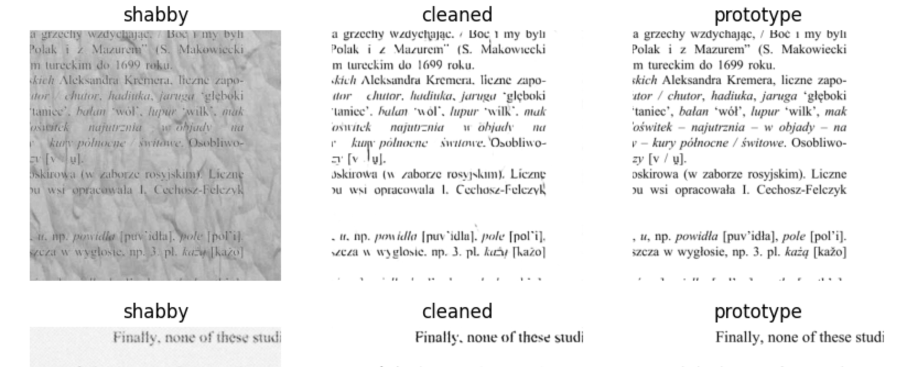
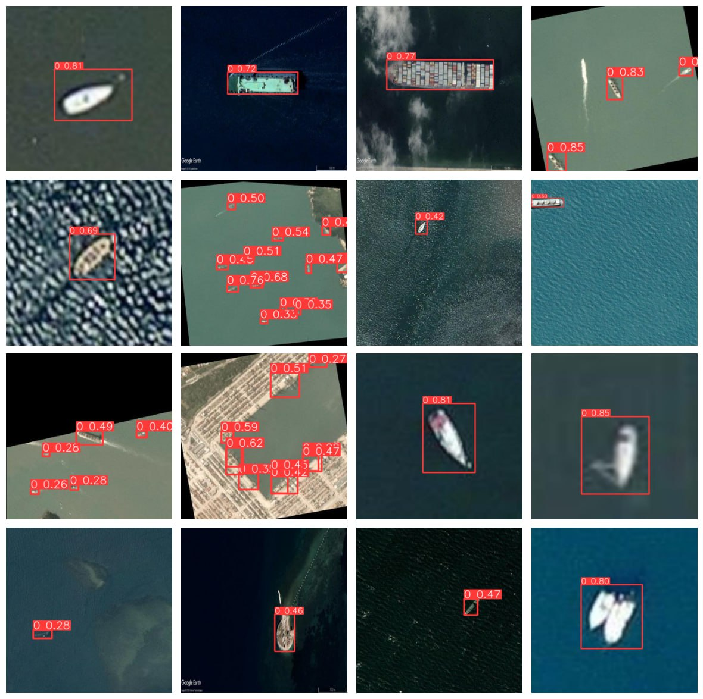

# cv_project_streamlit_app

Computer Vision Project

## Чтобы воспользоваться нашим приложением, перейдите по ссылке [Streamlit](https://computervision-yolo.streamlit.app)

### Команда: [Роман](https://github.com/r-makushkin), [Руслан](https://github.com/ruslan-DS), Анастасия

**Проект:** Очищение документов от шума📝 и Детекция объектов🔎. [Датасет](https://www.kaggle.com/datasets/siddharthkumarsah/ships-in-aerial-images)
## Две части.
### 1. Автоэнкодер для очищения фотографий от шума.
##### Задачи:
* Создать архитектуру модели для кодирования и декодирования входного объекта.
* Провести обучение, учитывая следующие нюансы: делать предсказание модели на объекте с шумом, уменьшать Loss-func на аналогичном объекте без шума.
* Отобрать веса, которые показали наилучший результат на тестовой выборке.

### 2. Детекция судов и кораблей на фотоснимках.
#####  Задачи:
* Загрузить размеченный датасет для детекции.
* Протестировать результаты детекции на нескольких моделях (в приоритете были модели YOLOv5 и YOLOv8).
* Выбрать наиболее оптимальную модель (веса) по объему памяти, количеству слоев и скорости предсказания.

